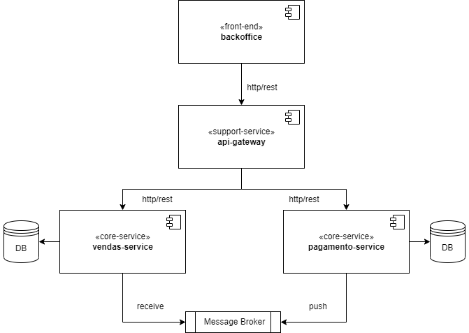

# DESAFIO KLOK

    

## REQUISITOS:
- Implementar uma API RESTFul capaz de gerenciar vendas (cadastrar; atualizar; e cancelar;) e gerar cobranças para estas vendas através de um job/scheduler configurável.
- Implementar uma segunda API RESTFul que recebe pagamentos via REST, se comunica com o serviço acima via mensageria (RabbitMQ ou SQS) e finaliza sua respectiva cobrança, baseada no pagamento recebido.
- Os serviços e bancos deverão subir através de containers Docker;
- Ambas apis deverão ser privadas, sendo necessário informar um token JWT para acessá-las;
- Front-End em Angular 9+ que contemple: login, CRUD de vendas; CRUD de cobranças; CRUD de pagamentos;
- Testes unitários;

## DIFERENCIAIS:
- Boas práticas de programação
- Utilização de Domain Driven Design
- API Gateway
- Uso de AWS

## TECNOLOGIAS:
- Java 8+
- Spring Boot
- Spring Security
- Spring Data
- Spring MVC
- JWT
- RabbitMQ ou SQS
- SQL Migration com Flyway
- ApiDoc com Swagger
- Angular 9+
- Postgres 10+

## CRITÉRIOS AVALIADOS:
- Funcionamento;
- Consistência do modelo / aderência ao mundo real;
- Qualidade do código;
- Inovação;
- Testes;
